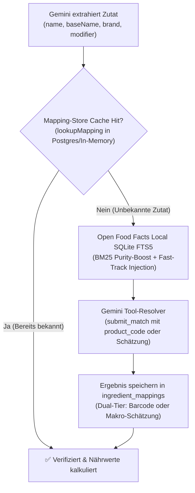

# ⚙️ Backend & Datenbank (Node.js & Supabase Postgres)

## 1. Processing- & Database-Layer

* **Technologie:** Express.js, TypeScript (ausgeführt über `tsx` / Direct-Node execution), Node.js 22+ (erforderlich für `@supabase/supabase-js` native WebSockets).
* **Datenbank:** Supabase Postgres (`backend/src/db.ts`) mit Row-Level Security (RLS) über `@supabase/supabase-js`. Alle benutzerbezogenen Queries filtern mit `.eq('user_id', userId)`, um mandantenfähige Isolation zu gewährleisten. Interne Queue-Operationen (`getNextPendingJob`, `updateJob`) arbeiten ohne User-Scoping.
* **Authentifizierung:** Supabase Auth JWT-Verifikation (`backend/src/auth.ts`). Die Middleware `requireAuth` validiert den `Authorization: Bearer <token>` Header, extrahiert die User-ID via `auth.getUser(token)` und reicht sie als `req.userId` an alle Route-Handler weiter. Unterstützt sowohl E-Mail/Passwort- als auch Google OAuth-Authentifizierung nahtlos.
* **RLS-Policies:** Die `jobs`-Tabelle ist mit vier RLS-Policies abgesichert: `SELECT`/`INSERT`/`UPDATE`/`DELETE` – alle an `auth.uid() = user_id` gebunden. Der `user_id`-Fremdschlüssel referenziert `auth.users.id`.
* **Funktion:** Das Backend dient als asynchroner Job-Orchestrator, verwaltet Jobs und lädt Audiodateien temporär herunter.

### History, ID-Vergabe & Verwaltung
* Bietet Helper-Funktionen (`getAllJobs(userId)` und `deleteJob(id, userId)`) zur persistenten Abfrage und Bereinigung von Extraktionen – stets benutzerbezogen.
* Stellt REST-Endpunkte bereit: `GET /api/recipes` (das Kochbuch des authentifizierten Users), `GET/PATCH/DELETE /api/recipes/:recipeId` (lesen, Inhalt aktualisieren z. B. bei Basis-Portionsänderungen, aus dem Kochbuch entfernen) und `DELETE /api/users/me` (löscht das Benutzerkonto über die Supabase Admin API).
* **`recipeId` ist die einzige client-seitige ID** für alles, was ein Rezept betrifft (`/favorite`, `/flags`, `/collections`, `/cooked`, `/cook-history`, `/chat*`, `/remix`); die `user_recipes`-Zeile wird serverseitig über `(user_id, recipe_id)` aufgelöst. `GET /api/jobs/:id` bleibt ausschließlich Polling-Kanal und liefert `recipeId`, sobald der Job fertig ist.
* **Abbrechen ≠ Löschen:** `POST /api/jobs/:id/cancel` bricht eine laufende Extraktion ab, `DELETE /api/recipes/:id` entfernt ein Rezept aus dem Kochbuch. Beides war früher derselbe Aufruf — genau die Vermischung, die den Soft-Delete erzwungen hat.
* **Eindeutige Identifikation:** Normalisiert Rezepte bei Abfragen und versieht sie mit einer eindeutigen `id` (entspricht der `jobId`), um Kollisionen zwischen Rezepten mit gleichem Titel zu unterbinden.
* **Caching-Deaktivierung:** Setzt explizit `Cache-Control` Header (`no-store, no-cache, must-revalidate, proxy-revalidate`) für dynamic endpoints (`/api/jobs` und `/api/jobs/:id`), um zu verhindern, dass Browser veraltete/gecachte Job-Zustände ausliefern.

### Admin-Bereich & RLS-Bypass
Exponiert administrative API-Routen unter `/api/admin/*`, die über die Middleware `requireAdmin` abgesichert sind. Diese Middleware prüft, ob die E-Mail des authentifizierten Nutzers in der kommagetrennten Liste `ADMIN_EMAILS` (in `.env` konfiguriert) enthalten ist.
* **Endpunkte:**
  * `GET /api/admin/check`: Prüft Admin-Status.
  * `GET /api/admin/settings` & `PATCH /api/admin/settings`: Liefert und aktualisiert Werte in `global_settings` (invalidiert den internen Cache).
  * `POST /api/admin/notifications/trigger`: Führt manuell einen Durchlauf des Push-Notification Workers für Tests aus und liefert detaillierte Ausführungsprotokolle.
  * `GET /api/admin/feedback`: Ruft alle In-App Bug-Reports und Feedback chronologisch ab.
  * `GET /api/admin/metrics`: Aggregiert Benutzerzahlen, Rezept-Queue-Status inklusive `failedJobs` Details, sowie Gemini-Token- und Kostenstatistiken. Acceptiert einen `range`-Query-Parameter (`all`, `today`, `3d`, `7d`, `30d`).
* Klickt der Admin in der Queue-Status-Karte auf "Fehlgeschlagen", klappt im Frontend eine Details-Karte mit Fehlergründen, User-E-Mail, Reel-Link und Zeitstempel aller gescheiterten Jobs im ausgewählten Zeitfenster auf.

### Security-Hardening (`backend/src/index.ts`)
* **`helmet`:** Setzt Security-Header. `crossOriginResourcePolicy` ist auf `cross-origin` gesetzt, damit `recipe-images` aus anderen Origins geladen werden können. CSP wird in Production aktiviert.
* **`express-rate-limit`:** Limitiert `/api/*`-Endpunkte auf 100 Requests pro 15-Minuten-Fenster pro IP (`standardHeaders: true`).
* **CORS-Hardening:** In Development permissiv (`http://localhost:5173`), in Production restriktiv über `CORS_ORIGIN` steuerbar. Nur `GET`, `POST`, `DELETE`, `PATCH`, `PUT` erlaubt.
* **`trust proxy`:** Auf `1` gesetzt für korrekte Rate-Limiting-Erkennung hinter Reverse-Proxies.
* **Body-Limit:** `express.json({ limit: '1mb' })` schützt vor Memory-Exhaustion durch große Payloads (Foto-Import nutzt pfad-spezifischen 12MB Parser davor).

### Health-Check (`/health`)
Erweiterter Endpunkt prüft Supabase-Datenbankverbindung via `checkDbHealth()` (HEAD-Request auf `jobs`-Tabelle). Antwortet `200 OK` bei gesunder DB, `503 Service Unavailable` bei Problemen. Liefert `uptime`, `nodeEnv` und `dbConnected`-Status.

### Statische Assets & Zutat-Icons Distribution (`/api/ingredient-icons/*` & `/api/category-icons/*`)
* **Icons-Katalog:** Das Backend liefert über 760 KI-generierte Zutat-Icons (`.webp`) und 20 Kategorie-Icons aus (`backend/src/ingredientImageRoutes.ts`).
* **Optimierte Git- & Container-Auslieferung:**
  * Um das Git-Repository nicht mit hunderten einzelnen Binärdateien aufzublähen, werden alle Zutat-Icons in einem einzigen komprimierten Archiv `backend/public/ingredient-icons.zip` (~13 MB) in Git versioniert.
  * In `.gitignore` sind die entpackten `backend/public/ingredient-icons/*.webp` ignoriert.
  * **Startup Auto-Extraction (`backend/src/ingredientIconPacker.ts`):** Beim Start des Backends (lokal und auf Railway) prüft `ensureIngredientIconsExtracted()` im `bootstrap()`, ob die Icons entpackt werden müssen (z. B. im frischen Docker-Container oder nach Repo-Clone) und extrahiert diese via `adm-zip` in ~200ms nach `backend/public/ingredient-icons/`. Ein Timestamp-Stamp (`.unpacked_stamp`) verhindert unnötige Extraktionen bei bestehendem Datenstand.
  * **CLI-Befehle:**
    * `npm run icons:zip`: Packt alle aktuellen `.webp`-Dateien aus `backend/public/ingredient-icons/` in `ingredient-icons.zip`.
    * `npm run icons:unpack`: Entpackt das Zip-Archiv manuell (unterstützt `--force`).
    * `npm run audit:ingredients`: Startet die autonome Audit-Pipeline (unterstützt `--dry-run`, `--interactive` / `-i` / `--debug`, `--limit <N>`, `--budget <USD>`, `--force`, `--key <key>`).
    * `npm run mappings:backfill`: Befüllt die `ingredient_mappings`-Tabelle (unterstützt `--prod` für Rezepte aus Production, `--ai` / `--ai-prompt` / `--ai-category` / `--count` für synthetische KI-Zutatenlisten, oder `--ingredients="..."` für manuelle Listen).
    * Der Batch-Generator (`generateBaseNameIngredientIcons.ts`) und die Audit-Pipeline aktualisieren das Zip-Archiv nach Änderungen automatisch.

### Autonome KI-Audit-Pipeline (`backend/src/audit/`)
* **Ziel:** Kontinuierliche Validierung von OpenFoodFacts-Nährwert-Mappings und Qualitätsprüfung der 512×512 Zutat-Icons.
* **Ablauf pro Zutat:**
  1. **Mapping-Plausibilität & OFF-Recherche (`mappingAuditor.ts`):** Prüft Name, Kategorie und Nährwerte. Bei `no_match` oder unplausiblen Zuordnungen führt Gemini eine erweiterte Suche mit Synonymen und Übersetzungen im lokalen SQLite OpenFoodFacts-Index durch und aktualisiert das Mapping in Supabase.
  2. **Icon-Geometrie & Auto-Zoom (`iconGeometry.ts`):** Pixel-Bounding-Box-Analyse gegen weißen Hintergrund. Bei zu kleinen Motiven (> 25% Randabstand) skaliert Sharp das Motiv verlustfrei auf exakt 20% Randabstand (**$0 API-Kosten**). Bei Rand-Clipping (< 8% Rand) wird das Icon mit Flux-1 neu generiert.
  3. **Multimodal Vision Check (`iconAuditor.ts`):** Gemini Flash Lite Vision validiert das gerenderte Motiv auf Isoliertheit und Korrektheit.
* **Lokale Manifeste & Caching (`auditManifest.ts`):** Bestätigte Mappings (`mappings_manifest.json`) und Icons (`icons_manifest.json`) werden lokal gecached, sodass Aliasse und Folgeläufe $0 zusätzliche Kosten verursachen.
* **Tagesbudget-Schutz (`budgetTracker.ts`):** Überwacht tägliche Ausgaben in `daily_budget.json` gegen `DAILY_AUDIT_BUDGET_USD` (Default: $1.00/Tag) und pausiert die Pipeline bei Erreichen des Limits automatisch.

---

## 2. Rolling Timeframe Rate Limiting (Extraktionsbegrenzung)

* **Globale Limits:** Gesteuert über `.env`-Umgebungsvariablen / `global_settings`:
  * `EXTRACTION_LIMIT_WINDOW_DAYS` (Default: `1`): Größe des rollierenden Fensters in Tagen.
  * `FREE_MAX_EXTRACTIONS_PER_WINDOW` (Default: `3`): Maximale Anzahl an Extraktionen für Free-User.
  * `PREMIUM_MAX_EXTRACTIONS_PER_WINDOW` (Default: `50`): Maximale Anzahl an Extraktionen für Premium-User.
* **Subscription Tiers:** Standardmäßig im `free` Tier. Sobald Premium gekauft wird, wird das Tier in `app_metadata.tier` auf `premium` gesetzt. Im Alpha-Modus werden Nutzer automatisch in `alpha` eingestuft.
* **Benutzerbezogene Overrides:** In Supabase Auth `app_metadata` gesteuert (`custom_extraction_limit` bzw. `max_extractions_per_window`, z. B. `-1` für unbegrenzt).
* **Rewarded Video Ad Bonus-Credits (`app_metadata.bonus_credits`):**
  * Nutzer können durch das Ansehen von Rewarded Video Ads verzehrbare Extraktions-Credits sammeln.
  * **Konfigurierbarkeit (`global_settings.rewarded_ad_bonus_credits`):** Die Anzahl der gutgeschriebenen Credits pro Video (Standard: 3) ist zentral in der Postgres-Tabelle `global_settings` hinterlegt und über die Admin-API (`/api/admin/settings`) steuerbar.
  * **Claim-Endpunkt (`POST /api/me/rewarded-ad-claimed`):** Inkrementiert `app_metadata.bonus_credits` in Supabase Auth (`updateUserById`) atomar um den in `global_settings` definierten Wert.
  * **Verfügbarkeits-Berechnung (`GET /api/extractions/limit`):** Addiert Bonus-Credits auf verbleibende Basis-Extraktionen (`remaining = baseRemaining + bonusCredits`) und liefert `rewardedAdBonusCredits` an den Client.
  * **Quota-Verbrauch (`enforceExtractionQuota` in `routes.ts`):** Wenn das zeitfensterbasierte Limit erreicht ist, aber `bonus_credits > 0` vorliegt, wird 1 Bonus-Credit abgebucht (`bonus_credits - 1`), anstatt die Extraktion mit `RATE_LIMIT_EXCEEDED` (429) zu blockieren.
* **Nutzererfahrung:** Bei Erreichen des Limits berechnet das Backend die verbleibende Wartezeit minutengenau. Das Frontend übersetzt dies dynamisch und zeigt die genaue Restdauer an.

---

## 3. Cloud-Infrastruktur (Supabase & Railway)

* **Tabelle `recipes`:** Der Rezept-**Inhalt**, unabhängig davon, wer ihn extrahiert hat. Skalare sind echte Spalten (`title`, `emoji`, `prep_time`, `cook_time`, `servings`, `image_url`, `has_incomplete_source_info`, …), flache Listen `text[]` (`tags`, `equipment`, `tips`, `image_urls`), nur `ingredients`/`instructions`/`alternative_ingredients` bleiben JSONB. Nährwerte liegen als vier Skalare (`calories`, `protein_g`, `carbs_g`, `fat_g`) vor, weil auf ihnen gefiltert und sortiert wird.
  * `has_incomplete_source_info` (boolean): Kennzeichnet Rezepte, bei denen in der Originalquelle keine vollständigen Rezeptangaben (Zutaten/Mengen/Schritte) existierten und das Rezept visuell aus dem Video rekonstruiert wurde (aktiviert die Hinweiskarte im Frontend).
  * `created_by` ist **nullable**: eine Account-Löschung nullt das Feld, statt zu cascaden — sonst würde sie die Kochbücher anderer Nutzer zerstören.
  * `visibility` (`private` | `unlisted` | `public`) und `origin` (`url` | `photo` | `remix`) sind der Andockpunkt fürs spätere Teilen/Veröffentlichen.
* **Tabelle `jobs`:** Nur noch der **Extraktions-Task** (`id`, `user_id`, `kind`, `status`, `source_url`, `source_url_normalized`, `progress`, `recipe_id`, `parent_recipe_id`, `remix_prompt`, `error`, `llm_usage`, `media_bytes`, `locked_at`, `locked_by`).
  * `progress` (JSONB): `{percent, stage}` während des Laufs. Früher wurde der Fortschritt durch die `recipe`-Spalte geschmuggelt (`{isProgress:true, …}`), was fehlgeschlagene Jobs mit toten Platzhaltern zurückließ.
  * `llm_usage` (JSONB): Kosten/Tokens **dieses Laufs** (`gemini`, `flux`) — bewusst nicht am Rezept, damit ein geteiltes Rezept nicht die Rechnung des Extrahierenden mitträgt.
  * **Job-Zeilen werden nie gelöscht.** Sie sind der Audit-Trail; ein Abbruch ist `status='cancelled'`, kein Soft-Delete. Abgebrochene (`cancelled`) und fehlgeschlagene (`failed`) Jobs belasten das Rate-Limit nicht.
* **Tabelle `user_recipes`:** Der **Kochbuch-Eintrag** pro User (`user_id`, `recipe_id`, `source_job_id`, `source`, `is_favorite`, `flags`, `added_at`). Wird beim Entfernen eines Rezepts **hart gelöscht** — die Quota hängt an `jobs`, also darf das Kochbuch ehrlich löschen. `source='share'` ist der Andockpunkt fürs Teilen ohne Content-Kopie.
* **RPC `complete_job(job_id, recipe, llm_usage)`:** Schließt einen Job atomar über alle drei Tabellen ab (Rezept anlegen, Job verknüpfen, ins Kochbuch legen). Ohne die Funktion gäbe es ein Crash-Fenster, in dem ein Nutzer Quota bezahlt hat und kein Rezept bekommt.
* **Zwei getrennte Quoten:** Der Kochbuch-Cap zählt `user_recipes` (schrumpft beim Löschen), das Rate-Limit zählt `jobs` (schließt `remix`, `failed` und `cancelled` aus — Foto-Importe und erfolgreiche URL-Extraktionen kosten Quota).
* **Tabelle `feedback`:** Speichert In-App Bug-Reports & Feedback (`id`, `user_id`, `type`, `message`, `context`, `screenshot_urls`, `created_at`).
* **Storage Buckets:**
  * `recipe-covers` (öffentlich): Generierte FLUX.1 Food-Fotografie-Coverbilder (`${userId}/${jobId}.jpg`).
  * `recipe-frames` (öffentlich): Extrahierter Frame per Job (`${jobId}/${index}.jpg`).
  * `feedback-screenshots` (privat): Screenshots für Bug-Reports (`${userId}/${feedbackId}/${index}.jpg`, 10-Jahres Signed URL).
  * `recipe-photos` (privat, service-role only): Transienter Foto-Import (`${userId}/${uploadId}/${index}.jpg`).
  * `cook-photos` (privat, service-role only): Fotos von gekochten Gerichten für Gamification.
* **Authentifizierung:** Token-Verifikation erfolgt **lokal** im Backend via JWKS (JSON Web Key Set) über `${config.SUPABASE_URL}/auth/v1/.well-known/jwks.json` mithilfe der `jose`-Bibliothek (kein DB-Roundtrip pro Request).

### Railway (Anwendungs-Hosting)
* Hostet die containerisierte Anwendung stateless.
* **Stateless Scaling (Web vs. Worker):** Gesteuert über Umgebungsvariable `ROLE` (`web` | `worker` | `both`).
  * `web`: Serviert API und Frontend-Assets.
  * `worker`: Führt die asynchrone Queue-Schleife aus (`claimNextJob`, Frame-Extraktion, Gemini-Upload).

---

## 4. Kanonische Zutatennormalisierung & Hybrid Matching Engine (`backend/src/matching/`)

Das Backend normalisiert KI-extrahierte Zutaten gegen die **Open Food Facts DACH Datenbank (437.000+ Einträge)** und einen **persistenten, selbstlernenden Mapping-Store** (`ingredient_mappings`), um portionsgenaue Makronährstoffe (Kalorien, Protein, Kohlenhydrate, Fett) in <1ms zu berechnen.

* **Datensatz:** Open Food Facts DACH (`backend/src/data/off_de.sqlite`, 437.000+ Supermarkt-, Marken- und Grundnahrungsmittel mit 100g-Referenzwerten, Purity-Boost und BM25-Volltextindex).
* **Selbstlernender Mapping-Store (`mappingStore.ts`):** Jede aufgelöste Zutat wird gecacht und in Postgres persistiert. Über 70% aller Zutaten werden instant ohne LLM-Kosten aufgelöst.
* **Dual-Tier Auflösung:** Produkte mit Barcode erhalten `resolution = 'matched'`. Abstrakte Mischungen (*Allzweckgewürz*, *Cajun-Butter*) erhalten `resolution = 'no_match'` mit dauerhaft gespeicherter Makro-Schätzung.
* **Marken-Trennung (`brand`):** Hersteller-/Markennamen (*Eat Lean*, *Miracle Whip*, *Philadelphia*, *Nutella*) werden in ein separates Feld `brand` ausgelagert, sodass `name` sauber und suchbar bleibt.
* **Generische Nährwert-Plausibilitätsprüfung (`isNutritionallyPlausible`):** Mathematischer Abgleich der geschätzten Nährwertdichte (kcal/100g, Fett, KH) gegen den Produkt-Kandidaten.
* **Rezept-Aggregation (`enrichRecipeWithCanonicalIngredients`):** Läuft auf **jedem** Pfad, der ein Rezept persistiert — URL-Extraktion, Foto-Import und Remix-Jobs im Hintergrund-Worker (`backend/src/queue.ts`), Chat-Remix und `PATCH /api/jobs/:id` in `routes.ts`. Berechnet Nährwerte pro Zutat (`calories`, `protein`, `carbs`, `fat`, `isVerified`, `canonicalId`, `matchedName`) und leitet daraus `recipe.nutritionalValues` pro Portion ab.
* **Nährwerte sind abgeleitet, nicht gespeicherter Zustand:** `nutritionalValues` wird bei jeder Anreicherung neu aus der Zutatensumme berechnet und nie vom Modell oder vom Client übernommen. Ein von der Quelle selbst genannter Wert liegt separat in `sourceNutritionalValues` (+ `hasExplicitNutritionalValues`) und wird in der UI daneben statt an dessen Stelle gezeigt. `nutritionCoverage` (0..1) gibt an, welcher Kalorienanteil aus verifizierten Datenbank-Treffern statt aus Gemini-Schätzungen stammt; erst ab 90 % gilt ein Rezept als datenbankverifiziert. Bestandsdaten werden per `npm run recompute-nutrition` (im `backend/`-Workspace) angeglichen.

---

## 5. 📅 Wochenplaner-Engine (`meal_plans` & `mealPlanRoutes.ts`)

* **Datenmodell (`backend/db/migrations/004_meal_plans.sql`):**
  * Tabelle `meal_plans` mit `id` (UUID), `user_id` (UUID), `recipe_id` (FK `recipes.id`), `plan_date` (DATE), `meal_type` (`breakfast`, `lunch`, `dinner`, `snack`), `servings` (NUMERIC), `is_cooked` (BOOLEAN) und `notes` (TEXT).
  * Fast-Lookup Composite-Index: `idx_meal_plans_user_date (user_id, plan_date)`.
  * RLS Policy: `"Users manage own meal plans"` (`auth.uid() = user_id`).
* **REST-Endpunkte (`backend/src/routes/mealPlanRoutes.ts`):**
  * `GET /api/meal-plan?startDate=YYYY-MM-DD&endDate=YYYY-MM-DD`: Liefert alle geplanten Einträge des Benutzers für den Zeitraum, gejoint mit Recipe-Metadaten (Titel, Bild, Zubereitungszeit, Nährwerte, Zutaten).
  * `POST /api/meal-plan`: Erstellt einen neuen Plan-Eintrag mit Validierung von `planDate` (Regex `^\d{4}-\d{2}-\d{2}$`) und `mealType`.
  * `PATCH /api/meal-plan/:id`: Aktualisiert Portionsanzahl, Datum, Mahlzeitentyp, Notiz oder `isCooked`-Status.
  * `DELETE /api/meal-plan/:id`: Löscht einen Plan-Eintrag isoliert für den anfragenden Benutzer.
* **Automatische Gamification-/Koch-Synchronisation:**
  * Beim erfolgreichen Kochen eines Rezepts (`POST /api/recipes/:id/cooked`) aktualisiert das Backend via `markMealPlansCookedForRecipe(userId, recipeId)` automatisch alle offenen Plan-Einträge dieses Rezepts für das aktuelle Datum (`is_cooked = true`), sodass Wochenplaner und Koch-Historie synchron bleiben.

---

## 6. 🥫 Vorratslager & Einkaufsliste (`pantry_items`, `shopping_list` & `pantryRoutes.ts`)

* **Datenmodell (`backend/db/migrations/006_pantry_and_shopping_list.sql`):**
  * `public.pantry_items`: Speichert Benutzervorräte mit `user_id`, `name`, `base_name`, `category`, `amount`, `unit`, `notes`, `shelf_life_days`, `expires_at`, `created_at`, `updated_at`.
  * `public.shopping_list`: Persistiert Einkaufslisten-Einträge in Supabase mit `user_id`, `recipe_id`, `name`, `base_name`, `amount`, `unit`, `checked`, `category`, `in_pantry_warning`.
  * `ingredient_mappings`: Erweitert um `typical_package_amount`, `typical_package_unit`, `shelf_life_days`.
  * RLS Policies: Benutzer sehen und editieren strikt nur ihre eigenen Vorrats- und Einkaufslisten-Einträge.
* **REST-Endpunkte:**
  * `/api/pantry`: `GET` (Liste), `POST` (Erstellen), `PATCH /:id`, `DELETE /:id`, `POST /consume-recipe/:recipeId`, `GET /suggestions`.
  * `/api/shopping-list`: `GET` (Liste), `POST` (Einzeln/Manuell), `POST /batch` (Batch-Import aus Rezept/Wochenplaner), `PATCH /:id` (Toggle/Edit), `POST /batch-toggle` (Multi-Check mit automatischem Vorrats-Transfer), `DELETE /:id`, `POST /delete-batch`, `POST /clear`, `POST /remove-recipe`.
* **Smarter Vorratsabzug & Anti-Food-Waste Algorithmus (`pantryDb.ts`):**
  * **Floor at Zero:** Beim Kochen eines Rezepts (`POST /api/recipes/:id/cooked`) werden benötigte Zutatensmengen automatisch vom Vorrat abgezogen, unter Einheitenumrechnung (`g` ↔ `kg`, `ml` ↔ `l`). Vorratsmengen werden bei 0 gefloort und fallen niemals ins Negative.
  * **Verschwendungs-Reduzierung (`getPantryRecipeSuggestions`):** Bewertet und sortiert gespeicherte und öffentliche Rezepte anhand der Übereinstimmung mit bald ablaufenden Vorratszutaten (`expires_at <= NOW() + 3 Tage`).
  * **Community-Rezept-Freigabe:** URL-extrahierte Rezepte sind standardmäßig `visibility = 'public'` (öffentlich), während Foto- und Remix-Rezepte privat bleiben. Benutzer können die Sichtbarkeit jederzeit über `PATCH /api/recipes/:id/visibility` anpassen.

