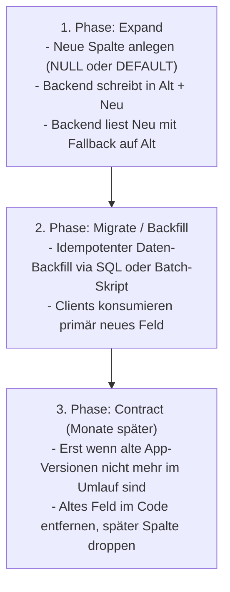

# 🛡️ Abwärtskompatibilität, Schema-Evolution & Datenbank-Migrationen

> **Status:** Verbindliche Richtlinie für alle Entwicklungen, KI-Assistenten und Releases ab Version 1.1.10.
> **Kontext:** Die Snagbite-App ist auf Google Play (Alpha/Production) und im Web live. In der Supabase-Produktionsdatenbank existieren echte Nutzerdaten, Sammlungen und hunderte Rezepte. Native Apps im Umlauf aktualisieren sich verzögert.

---

## 🎯 1. Grundprinzipien (Post-Launch Direktive)

1. **Zero Downtime & Zero Data Loss:** Schema-Änderungen und Deployments dürfen niemals bestehende Nutzerdaten beschädigen, Transaktionen blockieren oder Ausfallzeiten verursachen.
2. **Keine Breaking Changes:** Änderungen an Schnittstellen (API DTOs) oder Datenmodellen müssen abwärtskompatibel zu älteren, noch im Umlauf befindlichen nativen App-Versionen sein.
3. **Additive Schema-Evolution:** Bevorzuge immer das Hinzufügen neuer, optionaler Felder gegenüber dem Modifizieren oder Löschen bestehender Strukturen.
4. **Defensive Programmierung:** Gehe niemals davon aus, dass bestehende Datensätze (insbesondere JSONB-Felder wie `ingredients`, `instructions` oder `nutritional_values`) neu eingeführte Eigenschaften bereits besitzen.

---

## 🗄️ 2. Supabase Migrations-Workflow (Verbindlich)

Jede Änderung an der Postgres-Datenbank (Tabellen, Spalten, Indizes, Enums, RLS-Policies, Trigger, RPC-Funktionen) **MUSS** über eine transaktionale SQL-Datei im Ordner `supabase/migrations/` versioniert werden.

### Workflow-Befehle (Root `package.json`)

```powershell
# 1. Neue Migration mit sprechendem Namen anlegen
npm run db:new <feature_name>
# Erzeugt: supabase/migrations/<timestamp>_<feature_name>.sql

# 2. Migrations-Status prüfen (Differenz zwischen lokal und DB)
npm run db:status

# 3. Migration lokal oder auf Dev-DB anwenden
npm run db:push

# 4. History reparieren (Synchronisation nach Remote-Reverts)
npm run db:repair
```

### Regeln für Migrationsdateien (`.sql`)

* **Niemals unversioniertes DDL:** Führe niemals DDL-Befehle (`ALTER TABLE`, `CREATE TABLE`) direkt und undokumentiert im Supabase-Dashboard aus.
* **Idempotenz:** Verwende defensive Klauseln, damit Migrationen wiederholbar sind:
  * `CREATE TABLE IF NOT EXISTS ...`
  * `ALTER TABLE ... ADD COLUMN IF NOT EXISTS ...`
  * `CREATE INDEX IF NOT EXISTS ...`
  * `INSERT INTO ... ON CONFLICT (key) DO NOTHING;`
* **Transaktionalität:** Vermeide destructive Operationen in einem einzigen Block mit Datenmigrationen.

---

## 🔄 3. Das Expand-and-Contract Muster

Destruktive DDL-Operationen (`DROP COLUMN`, `RENAME COLUMN`, `ALTER COLUMN ... NOT NULL` ohne Default) sind auf produktiven Tabellen streng verboten. Restrukturierungen erfolgen immer nach dem **3-Phasen-Muster**:



### Erlaubte vs. Verbotene Operationen

| Operation | Status | Richtiger Ansatz |
| :--- | :--- | :--- |
| **Neue Spalte hinzufügen** | ✅ Erlaubt | Immer mit `NULL` oder `DEFAULT`: `ALTER TABLE t ADD COLUMN IF NOT EXISTS col TEXT DEFAULT '';` |
| **Spalte `NOT NULL` setzen** | ⚠️ Vorsicht | **Niemals** ohne `DEFAULT` auf bestehenden Tabellen! Vorher alle existierenden `NULL`-Werte per SQL befüllen. |
| **Spalte umbenennen** | ❌ Verboten | Neue Spalte hinzufügen (`Expand`), Daten kopieren, beide unterstützen. Altes Feld erst nach vollständigem Client-Rollout deprecaten. |
| **Spalte löschen** | ❌ Verboten | Zuerst im Code ignorieren, frühestens nach mehreren Release-Zyklen per Migration droppen. |
| **Index anlegen** | ✅ Erlaubt | `CREATE INDEX IF NOT EXISTS idx_name ON table(col);` |
| **Neuer Enum-Wert** | ✅ Erlaubt | `ALTER TYPE enum_name ADD VALUE IF NOT EXISTS 'new_value';` |

---

## 📱 4. API- & Contract-Kompatibilität (Mobile App Schutz)

Native Mobil-Apps verhalten sich fundamental anders als reine Web-Apps:
* Nutzer deaktivieren Auto-Updates oder installieren Updates erst nach Wochen.
* Zum Zeitpunkt eines Backend-Releases sind **mehrere App-Versionen gleichzeitig aktiv**.

### Regeln für REST-Endpunkte (`backend/src/routes/`)

1. **Bestehende JSON-Responses sind unveränderlich:**
   - Entferne niemals bestehende Keys aus JSON-Objekten.
   - Ändere niemals den Datentyp eines bestehenden Feldes (z. B. Zahl zu String oder Objekt zu Array).
   - Neue Daten müssen als **zusätzliche Properties** angehängt werden.
2. **Request-Payloads müssen tolerant sein:**
   - Neue Body- oder Query-Parameter müssen optional sein.
   - Wenn eine ältere App einen Parameter nicht mitsendet, muss das Backend einen stabilen Fallback-Wert annehmen.
3. **Error-Codes & Formate:**
   - Ändere keine HTTP-Statuscodes oder Fehler-Codes (`errorCodes.ts`), auf die bestehende App-Versionen mit UI-Sheets oder Handlern reagieren.

---

## 🧱 5. Defensives Handling von Legacy- & JSONB-Daten

In Supabase Postgres speichern wir Rezept-Bestandteile (`ingredients`, `instructions`, `nutritional_values`) in JSONB-Spalten. Altrezepte enthalten neu konzipierte Felder nicht.

### Regeln für Frontend & Backend TypeScript Code

1. **Immer Optional Chaining (`?.`) und Nullish Coalescing (`??`):**
   ```ts
   // ❌ GEFÄHRLICH: Wirft TypeError bei Altdaten
   const unit = item.normalized.unit;
   const prep = recipe.instructions[0].step;

   // ✅ SICHER & ROBUST:
   const unit = item.normalized?.unit ?? item.unit ?? '';
   const prep = recipe.instructions?.[0]?.step ?? '';
   ```
2. **Normalisierungs-Helper:**
   - Verwende zentrale Parser/Normalisierer (z. B. `normalizeRecipe()`), die fehlende Eigenschaften auf sichere Defaults abbilden, bevor die UI sie rendert.
3. **Idempotente Backfill-Skripte:**
   - Bei jeder strukturellen Neuerung muss ein passendes Batch-Skript unter `backend/src/scripts/` existieren (z. B. `backfillPublicRecipeCovers.ts`, `recomputeNutrition.ts`).
   - Backfills müssen in Batches (z. B. 50–100 Zeilen) arbeiten, Logging bieten und via `--dry-run` testbar sein.

---

## ✅ 6. Pre-Commit / Pre-PR Checkliste

Vor jedem Commit oder PR, der Datenbank, API oder Datenmodelle betrifft:

- [ ] Wurde für jede DB-Änderung eine Migration mit `npm run db:new` erstellt?
- [ ] Sind alle neuen Spalten `NULL`-able oder besitzen einen sicheren `DEFAULT`-Wert?
- [ ] Wurde keine aktive Spalte gelöscht oder umbenannt?
- [ ] Wurden alle API-Response-Änderungen rein additiv vorgenommen?
- [ ] Wurde in UI und Backend geprüft, ob der Code mit Altdaten ohne die neuen Felder fehlerfrei läuft?
- [ ] Wurde `npm run build` im Monorepo fehlerfrei ausgeführt?
