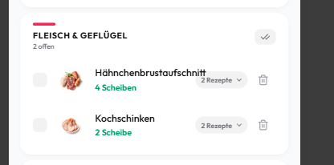
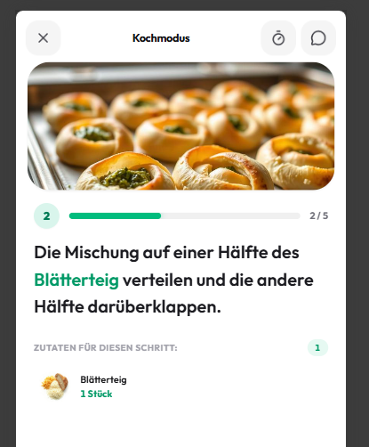
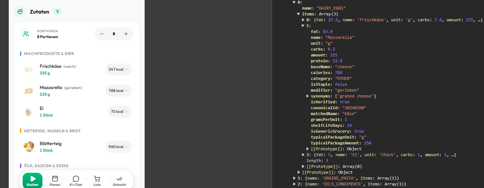
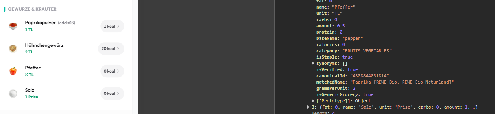

# Feature Ideas

## Features

- Rezepte manuell ändern und speichern

- rezepte wiederverwenden wenn es in der sprache bereits existiert, bzw. wenn andere  sprache verlangt bestehendes rezept nur von ki übersetzen und dann persistieren

- Für das vorschlagen von rezepten im Vorrat - eventuell hat user keine passenden rezepte, man könnte doch eventuell auf öffentliche rezepte zurückgreifen (aktuell sind alle rezepte in der recipes tabelle auf private visability, wie könnten wir das ausbauen?)

- healthy score für ein rezept berechnen

- rezept tinder mit öffentlichen rezepten

- Response bei Rezept kochen ohne Foto fehlt

- überarbeitung von extraction page, style, struktur, aufbau, weniger technisch

- extraction animation soll keine technischen schritte des erstellungsprozesses preisgeben, zb. cover image generieren oder video herunterladen, nichts davon soll der user sehen

- neue bilder für demo rezepte generieren (flux)

- update von premium features und update von paywall

- einführung von animation illustrationen über iconscout (extraktion, empty states, ...)

## Bugs / Improvements (Behoben ✅)

- [x] Autonome KI-Audit-Pipeline für Mappings & Zutat-Icons (`backend/src/audit/`, `npm run audit:ingredients`)
- [x] zutat text geht über Rezepte badge

## Bugs / Findings
- text in cooking mode soll mehr abstand innerhalb haben

- Mozarella bekommt base name cheese und wird nicht mit mozarella gemapped und deshalb wird falsches icon angezeigt

  

- pfeffer wird falsch gemapped mit paprika obwohl base name pepper eigentlich stimmt

  

