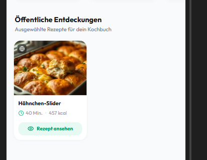

# Feature Ideas

> 🏁 **Google Play Store Go-Live:** Alle verbindlichen Compliance-, AdMob-, Paywall- und Release-Schritte vor der Veröffentlichung sind in der [**Google Play Store Go-Live Checklist**](go-live-checklist.md) dokumentiert.

## Features

- Rezepte manuell ändern und speichern

- rezepte wiederverwenden wenn es in der sprache bereits existiert, bzw. wenn andere  sprache verlangt bestehendes rezept nur von ki übersetzen und dann persistieren

- Für das vorschlagen von rezepten im Vorrat - eventuell hat user keine passenden rezepte, man könnte doch eventuell auf öffentliche rezepte zurückgreifen (aktuell sind alle rezepte in der recipes tabelle auf private visability, wie könnten wir das ausbauen?)

- rezept tinder mit öffentlichen rezepten

- einführung von animation illustrationen über iconscout (extraktion, empty states, ...)

- **Rezept-Schwierigkeitsgrade (Difficulty Levels):**
  - Schwierigkeitsgrad zu Rezepten hinzufügen (`Einfach`, `Mittel`, `Schwierig` / Beginner, Intermediate, Advanced).
  - Anzeige: Im Rezept-Header/Detailansicht und als kompaktes Badge/Icon auf den Rezeptkarten im Katalog.
  - Filter: Facetten- bzw. Schnellfilter im Kochbuchkatalog nach Schwierigkeitsgrad.
  - Gamification-Integration: Mehr XP / Belohnungspunkte für anspruchsvollere Rezepte vergeben (z. B. gestaffelte XP-Boni: Einfach = Basis-XP, Mittel = +50%, Schwierig = +100% XP).
  - Bestimmung der Schwierigkeit:
    - *Deterministisch messbar?* Anhand von Heuristiken/Metriken wie Zubereitungszeit, Anzahl Zutaten, Anzahl Schritte, parallele Kochschritte oder Kochtechniken/Equipment?
    - *Oder per KI abfragen?* Direkt von Gemini bei der Extraktion im strukturierten JSON-Schema bewerten lassen (`difficulty: 'EASY' | 'MEDIUM' | 'HARD'`) – ggf. kombiniert mit einem deterministischen Plausibilitätscheck/Fallback.

- **Öffentliche Rezepte entdecken / Browsen:**
  - Eigenständiges, interaktives Browse-Erlebnis für alle öffentlichen Rezepte (in Verbindung mit dem Teaser der 6 öffentlichen Rezepte im Kochbuch).
  - Soll mehr Spaß machen und inspirieren als eine einfache Liste (z. B. Swipe-Karten, thematische Karussells oder visuelles Magazin-Layout).
  - Nahtlose 1-Klick-Übernahme ins eigene Kochbuch oder direktes Kochen.

- **Dynamisches Nachladen von Rezepten (Pagination / Lazy Loading):**
  - Die API (`GET /api/recipes`) soll nicht mehr blind alle Rezepte auf einmal liefern, um Payload, Bandbreite und initiale Latenz bei großen Sammlungen gering zu halten.
  - Paginierung (Cursor-basiert oder Page/Limit) mit effizientem Nachladen im Hintergrund (Infinite Scroll / Background Prefetching).
  - Nahtlose Synchronisation mit dem lokalen IndexedDB-Cache (`recipe-image-cache`) und flüssiges Rendering ohne UI-Ruckler.

- **Ingredient Mappings & Icons vollständig berichtigen:**
  - Alle Zutat-Mappings, Normalisierungen (`baseName`) und zugeordneten Icons im Backend und Frontend überprüfen und berichtigen.
  - Inkonsistente oder fehlerhafte Zuordnungen bereinigen, damit jede Zutat verlässlich ihr passendes SVG/Icon und die richtige Supermarktkategorie erhält.

- **New User Experience (NUX) überarbeiten & aktualisieren:**
  - Onboarding- und Einführungserlebnis für neue Nutzer überarbeiten, modernisieren und aktualisieren.
  - Empty States (z. B. leeres Kochbuch, Wochenplaner, Einkaufsliste, Vorrat) auffrischen und Nutzer intuitiv zur ersten Aktion führen.

- **Vorrat-Feature: Workflow, UI & UX komplett überdenken:**
  - Den gesamten Ablauf rund um den Vorrat (Pantry) grundlegend hinterfragen und neu konzipieren: Nutzerführung, Pflegeaufwand und echter Alltagsmehrwert.
  - Workflow & Interaktionsdesign überarbeiten: Extrem schnelles Hinzufügen/Verwalten von Zutaten, nahtlose Synchronisation mit Einkaufsliste und automatisches Abbuchen beim Kochen.
  - UI & UX modernisieren: Aufgeräumte Bestandsübersicht, klare Kategorisierung und visuell ansprechendes Layout im Einklang mit dem Clean-Flat-Designsystem.
  - Smarteres Rezept-Matching: Präzise Vorschläge („Was kann ich kochen?“), Hervorhebung fast vollständiger Rezepte („Nur noch 1 Zutat fehlt“) und Rückgriff auf öffentliche Rezepte bei geringem Vorrat.

- **Google Play Store Go-Live & Release-Vorbereitung:**
  - Verbindliche Abarbeitung aller Store-Voraussetzungen (Restore Purchases Button, AdMob `app-ads.txt`, Data Safety, Reviewer-Account, Closed Testing) gemäß der [**Google Play Store Go-Live Checklist**](go-live-checklist.md).

- **Extraktions-Warteliste & Job-Historie auf der „NEU“-Seite (Fail-Safe Queue):**
  - **Schutz vor Link-Verlust:** Schlägt eine Extraktion temporär fehl (Netzwerkabbruch, API-Timeout, Instagram-Glitch), darf der Video-Link niemals verloren gehen – der Nutzer hat im Social-Media-Feed meist schon weitergescrollt.
  - **Job-Historie & Retry:** Auf der „Neu“-Seite eine kompakte Liste der letzten Extraktions-Jobs und fehlgeschlagenen Links anzeigen (inkl. 1-Klick-Retry und Link kopieren/öffnen).
  - **Vormerken bei aufgebrauchtem Kontingent:** Wenn das tägliche Extraktions-Limit erreicht ist, können Links trotzdem geteilt und in eine Warteliste abgelegt werden („Für später vormerken“).
  - **Smart Resume beim nächsten App-Start:** Sobald neues Kontingent vorhanden ist oder die App neu geöffnet wird, weist ein dezentes Overlay/Bottom-Sheet darauf hin: *„Du hast 1 Rezept in der Warteliste. Jetzt analysieren?“* (Nutzer behält volle Kontrolle, kein automatischer ungewollter Credit-Verbrauch).

- **Smarte Push-Benachrichtigungen: Hero-Zutaten statt Basis-Zutaten (Ingredient Spotlight Filter):**
  - **Problem & Feedback:** Aktuell fragt der Benachrichtigungs-Generator (`ingredient_spotlight`, siehe [push-notifications.md](push-notifications.md)) unpassend nach absoluten Grundnahrungsmitteln, Fetten oder Gewürzen (z. B. *„Lust auf Butter? Du hast x Rezepte mit Butter, Lust auf [Rezept]?“*). Niemand hat isoliert Lust auf „Butter“, „Salz“, „Pfeffer“, „Speiseöl“ oder „Zwiebeln“.
  - **Ausschluss von Basis- & Würz-Kategorien (Anti-Fragile):** Filterung im Kandidaten-Generator (`genIngredientSpotlight` in `backend/src/notifications/candidates.ts`) anhand strukturierter Kategorien (z. B. Ignorieren von `SPICES_SEASONINGS`, `OILS_VINEGARS`, `BAKING_COOKING`) sowie einer zentralen Ausschlussliste für geschmacksneutrale Küchenbasics (Salz, Pfeffer, Butter, Öl, Wasser, Zucker, Mehl, Speisestärke, Zwiebel, Knoblauch).
  - **Fokus auf echte Charakter-/Hero-Zutaten:** Benachrichtigungen ausschließlich für geschmacksprägende Hauptzutaten triggern, auf die man tatsächlich Appetit entwickeln kann (z. B. Avocado, Lachs, Kürbis, Burrata, Erdbeeren, Spargel, Pilze, Garnelen, Pasta, Süßkartoffel).
  - **Prompt-Optimierung für Gemini (`generateNotificationCopy`):** Den LLM-Prompt in `backend/src/gemini.ts` schärfen, sodass niemals plumpe Vorlagen wie *„Lust auf [Zutat]?“* generiert werden, sondern der kulinarische Kontext sympathisch, abwechslungsreich und appetitlich formuliert wird (z. B. *„Pasta-Lust? Du hast ein leckeres Rezept gespeichert...“*).

## Findings (Behoben ✅)

- [x] Paywall-Compliance & Feature-Update: Restore-Purchases-Button (`Purchases.restorePurchases()`), Verlinkung von AGB und Datenschutzerklärung, Bereinigung von UTF-8 Encoding-Glitches und saubere Klarstellung der echten Premium-Vorteile (`frontend/src/components/PremiumModal/`)
- [x] Response bei Rezept kochen ohne Foto: Sofortiges Toast-Feedback bei 0 XP / Duplikat und Ladezustand (`CookedModal.tsx`, `GamificationContext.tsx`)
- [x] Transparente & sympathische Overlay-Message vor erster Werbung (Free-Tier): Warmherziges Pre-Ad Transparenz-Sheet (`PreAdTransparencySheet.tsx`) vor der allerersten Werbeeinblendung via `useAppAds.ts` & `AppOverlays.tsx`
- [x] Empty-State-Mockups vereinfachen: Überkomplizierte Mini-Mockups in `ShoppingEmptyState.tsx` entfernt und durch Clean Flat Design mit klarem CTA ersetzt

- [x] Healthy Score für Rezepte berechnen & visualisieren (4-Säulen-Modell, konsolidierte `nutritional_values` JSONB-Spalte, `HealthScoreBadge` & `HealthScoreSheet`)
- [x] Mozzarella bekommt korrekten baseName `mozzarella` und mappt auf Mozzarella-Icon (behoben durch 2nd-Stage Recipe Auditor & Specificity Invariance)
- [x] Pfeffer mappt korrekt auf Speisepfeffer / `black pepper` mit Kategorie `SPICES_SEASONINGS` und Pfeffer-Icon (behoben durch Disambiguation & Category Isolation)
- [x] Autonome KI-Audit-Pipeline für Mappings & Zutat-Icons (`backend/src/audit/`, `npm run audit:ingredients`)
- [x] zutat text geht über Rezepte badge
- [x] überarbeitung von extraction page, style, struktur, aufbau, weniger technisch
- [x] extraction animation soll keine technischen schritte des erstellungsprozesses preisgeben, zb. cover image generieren oder video herunterladen, nichts davon soll der user sehen
- [x] text in cooking mode soll mehr abstand innerhalb haben (behoben: Zeilenabstand auf leading-[1.8] erhöht, Innenabstand py-3.5 und Chip-Padding optimiert)

## Findings
- Öffentliche Rezepte ausbauen:
    - view zum browsen von allen öffentlichen rezepten, aber anders als wenn man zb bei Zuletzt gespeichert auf "Alle 15" klickt und alle 15 aufgelistet werden. Es soll ein erlebnis sein, spaß machen
    - "Rezept ansehen" button nicht bei allen öffentlichen rezepten anzeigen, wiederholung
    - Rezept preview overlay etwas schmäler machen

- Wochenplaner
    - ich möchte keinen leeren screen wenn ich auf einen tag bin wo kein rezept geplant ist, grundsätzlich möchte ich immer alle zukünftig geplanten rezepte auf einen blick immer sichtbar haben.
    - Woche einkaufen button soll für jedes rezept den zutaten auswahl bottom sheet zeigen
