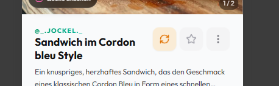
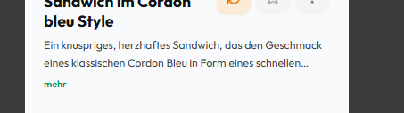
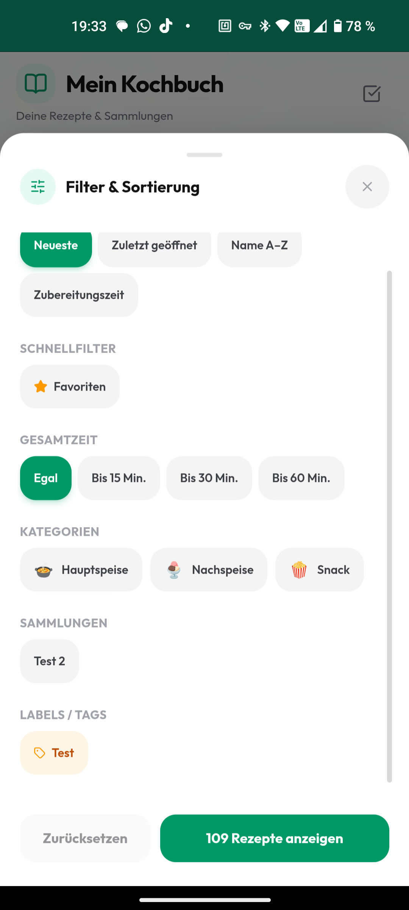
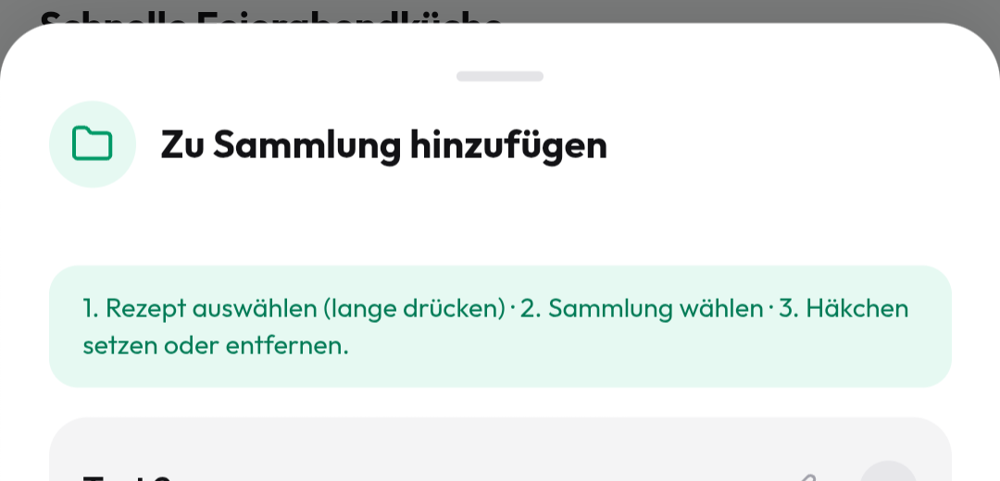
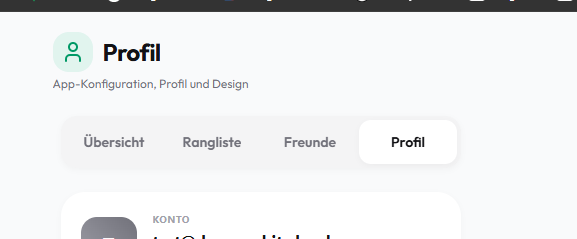
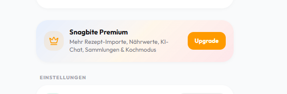

# Feature Ideas

## Features

- Rezepte manuell ändern und speichern

- rezepte wiederverwenden wenn es in der sprache bereits existiert, bzw. wenn andere  sprache verlangt bestehendes rezept nur von ki übersetzen und dann persistieren

- vorrat feature, ich kaufe lebensmittel ein für ein gericht und verbrauche nicht alles. erstens muss per gemini oder open food facts die typische packungsgröße oder gewicht, etc. ermittelt werden pro zutat, wenn ich dann diese zutaten einkaufe per einkaufslisten feature sind diese zutaten im lager/vorrat pro user, wenn rezept als gekocht markiert wird werden die zutaten aus dem lager entfernt, aber nur die menge die verbraucht wurde durch dieses rezept. das lager/vorrat kann dann beim hinzufügen von zutaten auf die einkaufsliste herangezogen werden (noch vorrätig, soll aber kontrolliert werden). weiters könnte man noch per ai pro zutat abfragen wie lange das durchschnittlich haltbar ist, damit und dem vorrat könnte man dann rezepte vorschlagen die zutaten aus dem lager und bald ablaufen besitzen damit alles auch verbraucht wird. eventuell hat user keine passenden rezepte, man könnte doch eventuell auf öffentliche rezepte zurückgreifen (aktuell sind alle rezepte in der recipes tabelle auf private visability, wie könnten wir das ausbauen?)

- healthy score für ein rezept berechnen

## Bugs / Improvements (Behoben ✅)

- [x] zutat text geht über Rezepte badge

- [x] dev button entfernen, nur mehr in menu

- [x] description soll nicht mehr collapsed werden, immer alles anzeigen

  

- [x] in rezept details nährwerte in progress bar werden nicht die tatsächlichen nährwerte angezeigt, sondern immer "fake" values

- [x] filter bottom sheet soll hälfte des screens einnehmen. verschiebe label und sammlungen filter zu schnellfilter

- [x] in sammlung hinzufügen bottom sheet entferne "1. Rezept auswählen..." karte

- [x] profil tab soll einstellungen heißen

- [x] beim premium banner statt dieses gradients sollten wir eine marken color palette für die app definieren und diese farben für den gradient verwenden

  

